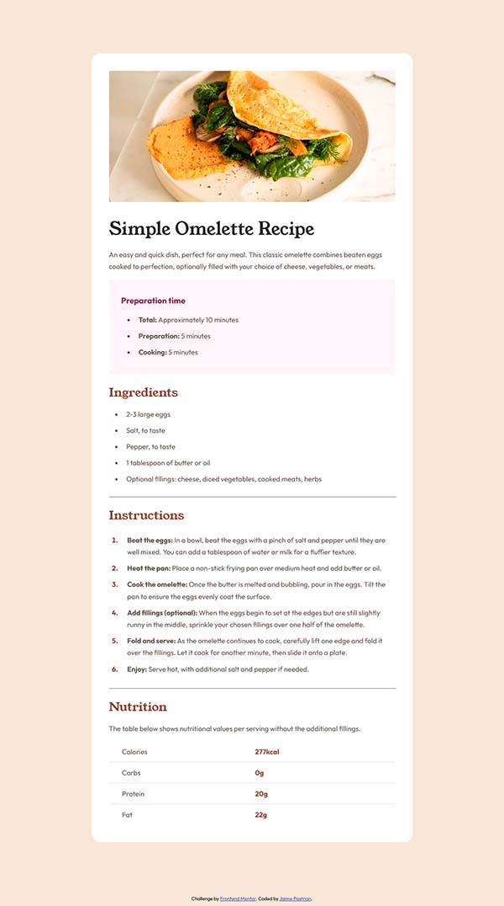

# Frontend Mentor - Recipe page solution

This is a solution to the [Recipe page challenge on Frontend Mentor](https://www.frontendmentor.io/challenges/recipe-page-KiTsR8QQKm). Frontend Mentor challenges help you improve your coding skills by building realistic projects. 

## Table of contents

- [Overview](#overview)
  - [The challenge](#the-challenge)
  - [Screenshot](#screenshot)
  - [Links](#links)
- [My process](#my-process)
  - [Built with](#built-with)
  - [Useful resources](#useful-resources)
- [Author](#author)

## Overview

### Screenshot

### Links

- Solution URL: [You can review my code here](https://github.com/jprush76/frontend-mentor-02-recipe-page)
- Live Site URL: [Live solution right here!](https://jprush76.github.io/frontend-mentor-02-recipe-page/)

## My process

### Built with

- Semantic HTML5 markup
- CSS variables
- Flexbox
- Responsive page

### Useful resources

- [Flexbox Guide](https://css-tricks.com/snippets/css/a-guide-to-flexbox/) - Every time I need to use flexbox, I open this guide.

## Author

- Website - _Don't have a website yet. I'm working on it._
- Frontend Mentor - [@jprush76](https://www.frontendmentor.io/profile/jprush76)
- Twitter - [@JaimePastrian](https://www.twitter.com/JaimePastrian)

